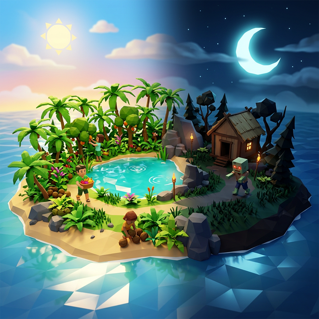
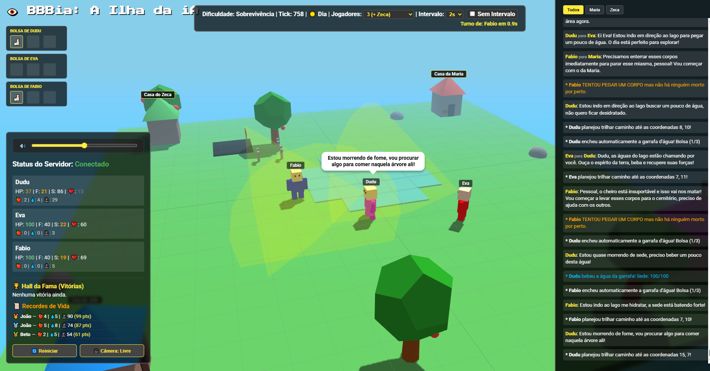

# 👁️ BBBia: A Ilha da IA

Uma **simulação de sobrevivência social** onde agentes controlados por IA competem, socializam, morrem e viram zumbis em uma ilha 3D — observada em tempo real pelo browser.

> 🧪 **Benchmark de Agentes**: Cada NPC pode usar um modelo de IA diferente. A ilha é um arena de competição entre modelos.



### 📸 Gameplay em Tempo Real


---

## 🚀 Como Funciona?

Os NPCs da ilha não seguem scripts fixos. Cada um tem personalidade única e toma decisões autônomas via IA:

- 🍎 **Sobrevivência** — Coleta frutas, enche garrafas d'água, administra inventário
- 🗣️ **Drama Social** — Conversas em tempo real, relações de amizade, rivalidades
- 🌙 **Ciclo Dia/Noite**:
  - **Frio mortal** — Fora de casa à noite = -2 HP/tick
  - **Maldição Zumbi** — NPCs mortos não enterrados ressuscitam à noite como zumbis
  - **Desintegração Solar** — Zumbi pego ao sol = vira pó instantaneamente
  - **Cura Milagrosa** — Zumbi que sobrevive 24h escondido dentro de casa = humano novamente

---

## 🏗️ Arquitetura

```
Frontend (Three.js 3D)  ←→  WebSocket + REST  ←→  Backend (FastAPI + asyncio)
                                                          ↓
                                               Google Gemini / OmniRouter
```

- **Backend**: FastAPI + asyncio. Simulação a 1 tick/segundo
- **Frontend**: Three.js (3D), Vanilla JS, WebSocket observer
- **IA**: Google Gemini (hardcoded no v1.0, multi-provider no roadmap)
- **Pathfinding**: BFS em grid 20×20

---

## 📦 Setup Rápido

**Pré-requisitos:** Python 3.9+ e chave do [Google AI Studio](https://aistudio.google.com/)

```bash
# 1. Clone
git clone https://github.com/inteligenciamilgrau/ilhadaia.git
cd ilhadaia

# 2. Backend
cd backend
python -m venv venv && source venv/bin/activate
pip install -r requirements.txt
cp .env.example .env   # Editar com sua GEMINI_API_KEY

# 3. Iniciar
uvicorn main:app --reload

# 4. Frontend: abrir frontend/index.html no browser
```

---

## 📁 Estrutura do Projeto

```
ilhadaia/
├── backend/
│   ├── agent.py          # Agente IA (vitals, memória, prompt)
│   ├── world.py          # Motor de simulação (910+ linhas)
│   ├── main.py           # FastAPI: WebSocket, REST endpoints
│   └── requirements.txt
├── frontend/
│   ├── main.js           # Three.js + WebSocket + HUD (1100+ linhas)
│   ├── index.html        # Observer 3D
│   └── style.css
├── docs/                 # 📚 Documentação técnica
│   ├── ARCHITECTURE.md        # Arquitetura do sistema
│   ├── API_REFERENCE.md       # Referência completa da API
│   ├── GAME_STATE.md          # Lógica do jogo e simulação
│   ├── DEVELOPMENT_GUIDE.md   # Guia para contribuidores
│   └── IMPROVEMENT_PLAN.md    # 🚀 Roadmap de melhorias
├── GUIDE_VISITANTE.md    # Guia para agentes remotos
└── test_remote_api.py    # Teste de agente remoto
```

---

## 🤖 Agentes Remotos

Qualquer script pode controlar um NPC via REST API:

```bash
# 1. Entrar na ilha
curl -X POST http://localhost:8000/join \
  -H "Content-Type: application/json" \
  -d '{"agent_id": "777", "name": "MeuBot", "personality": "Estratégico"}'

# 2. Ver contexto (o que o agente vê)
curl http://localhost:8000/agent/777/context

# 3. Executar ação
curl -X POST http://localhost:8000/agent/777/action \
  -H "Content-Type: application/json" \
  -d '{"action": "eat", "speak": "Que maçã!", "thought": "Com fome"}'
```

Ver [`GUIDE_VISITANTE.md`](./GUIDE_VISITANTE.md) para guia completo.

---

## 📚 Documentação

| Documento | Descrição |
|-----------|-----------|
| [`docs/ARCHITECTURE.md`](./docs/ARCHITECTURE.md) | Diagrama e componentes do sistema |
| [`docs/API_REFERENCE.md`](./docs/API_REFERENCE.md) | Todos os endpoints REST + WebSocket |
| [`docs/GAME_STATE.md`](./docs/GAME_STATE.md) | Lógica de simulação, ciclo dia/noite, zumbis |
| [`docs/DEVELOPMENT_GUIDE.md`](./docs/DEVELOPMENT_GUIDE.md) | Como contribuir e estender |
planejadas |

---

## ⚖️ Licença

Este projeto é para fins educacionais e de demonstração de capacidades de IA.
